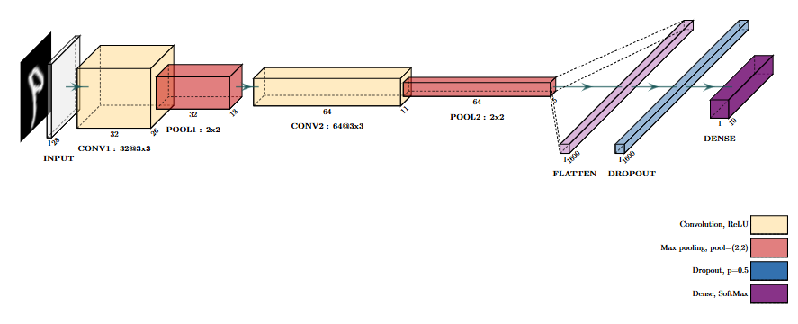
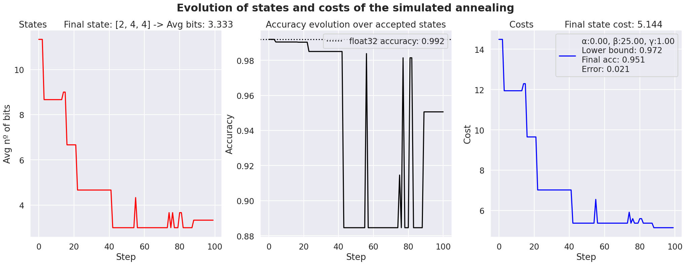

# QuantizeWithSA

Welcome to our PTQ repository, featuring a flexible quantization tool utilizing the Simulated Annealing algorithm. This tool empowers users to quantize their desired models with fixed-point precision, optimizing performance while preserving accuracy. Customize simulations, convergence steps, and search ranges for fractional bits, ensuring tailored quantization results. Control degradation thresholds and convergence guidance through adjustable hyperparameters for fine-tuning. Explore our repository and unlock efficient model compression with ease.

## Table of Contents

- [Installation](#installation)
- [Usage](#usage)
- [Examples](#examples)
- [Contributing](#contributing)
- [License](#license)

## Installation

### Using pip

1. Clone the repository:
    ```sh
    git clone https://github.com/DDobrzycki/QuantizeWithSA.git
    cd QuantizeWithSA
    ```

2. Create a virtual environment (optional but recommended):
    ```sh
    python -m venv QuantizeWithSA
    source QuantizeWithSA/bin/activate  # On Windows use `venv\Scripts\activate`
    ```

3. Install the required packages:
    ```sh
    pip install -r requirements.txt
    ```

### Using conda

1. Clone the repository:
    ```sh
    git clone https://github.com/DDobrzycki/QuantizeWithSA.git
    cd QuantizeWithSA
    ```

2. Create a conda environment from the provided environment file:
    ```sh
    conda env create -f environment.yml
    ```

3. Activate the conda environment:
    ```sh
    conda activate QuantizeWithSA
    ```

After completing these steps, the required dependencies will be installed, and you can start using the PTQ quantizer.

## Usage

To display the help message and see all available options, run the following command:
```bash
python3 main.py --help
```
### Example Output

When you run the help command, you will see an output like this:
```console
usage: main.py [-h] --model_name {cnn_mnist,convnet_js,custom} [--number_simulations NUMBER_SIMULATIONS] [--max_steps MAX_STEPS] [--min_frac_bits MIN_FRAC_BITS] [--max_frac_bits MAX_FRAC_BITS]
               [--max_degradation MAX_DEGRADATION] [--alpha ALPHA] [--beta BETA] [--gamma GAMMA] [--seed SEED] [--plots PLOTS]

Cuantize the desired model employing fixed point precision employing the simulated annealing algorithm

options:
  -h, --help            show this help message and exit
  --model_name {cnn_mnist,convnet_js,custom}, -m {cnn_mnist,convnet_js,custom}
                        Model to cuantize. If custom, it must be implemented first.
  --number_simulations NUMBER_SIMULATIONS, -ns NUMBER_SIMULATIONS
                        Nº of simulations. Set > 1 if want multiple cuantization results.
  --max_steps MAX_STEPS, -ms MAX_STEPS
                        Maximum number of steps of Simulated Annealing convergence algorithm.
  --min_frac_bits MIN_FRAC_BITS, -minb MIN_FRAC_BITS
                        Lower search range when simulating the quantification of the fractional part of the parameters.
  --max_frac_bits MAX_FRAC_BITS, -maxb MAX_FRAC_BITS
                        Upper search range when simulating the quantification of the fractional part of the parameters.
  --max_degradation MAX_DEGRADATION, -md MAX_DEGRADATION
                        Maximum degradation accepeted on models accuracy.
  --alpha ALPHA, -a ALPHA
                        Related with the importance of the lower bound.
  --beta BETA, -b BETA  Related with the importance of the average nº of bits employed for the cuantization.
  --gamma GAMMA, -g GAMMA
                        Related with the importance of diference between the cuantized model accuracy.
  --seed SEED, -s SEED  Seed for global determinism. Helps with replicating experiments but may slow down execution. Default is None.
  --plots PLOTS         Generates and saves plots of cost function convergence, as well as the evolution of the accuracy and importance of hyperparameters along the steps.
```

To run the project, use the following command:
```bash
python3 main.py --model_name {cnn_mnist,convnet_js,custom} 
```

## Examples

### Example 1: Quantizing the cnn_mnist Model
CNN architecture:


```bash
python3 main.py --model_name cnn_mnist --number_simulations 1 --max_degradation 2 --max_steps 100 --seed 42 --plots True
```

Generated Plots:


## Contributing

1. Fork the repository.
2. Create a new branch: `git checkout -b feature-name`.
3. Make your changes.
4. Push your branch: `git push develop feature-name`.
5. Create a pull request.

## License

Creative Commons Attribution-NonCommercial 4.0 International (CC BY-NC 4.0)

You are free to:
- Share — copy and redistribute the material in any medium or format
- Adapt — remix, transform, and build upon the material

Under the following terms:
- Attribution — You must give appropriate credit, provide a link to the license, and indicate if changes were made. You may do so in any reasonable manner, but not in any way that suggests the licensor endorses you or your use.
- Non-Commercial — You may not use the material for commercial purposes.

No additional restrictions — You may not apply legal terms or technological measures that legally restrict others from doing anything the license permits.

See the [LICENSE](./LICENSE.txt) file for more details.
